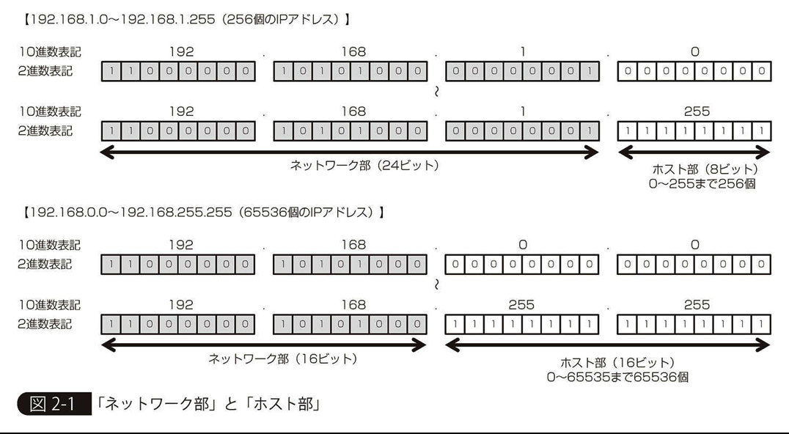
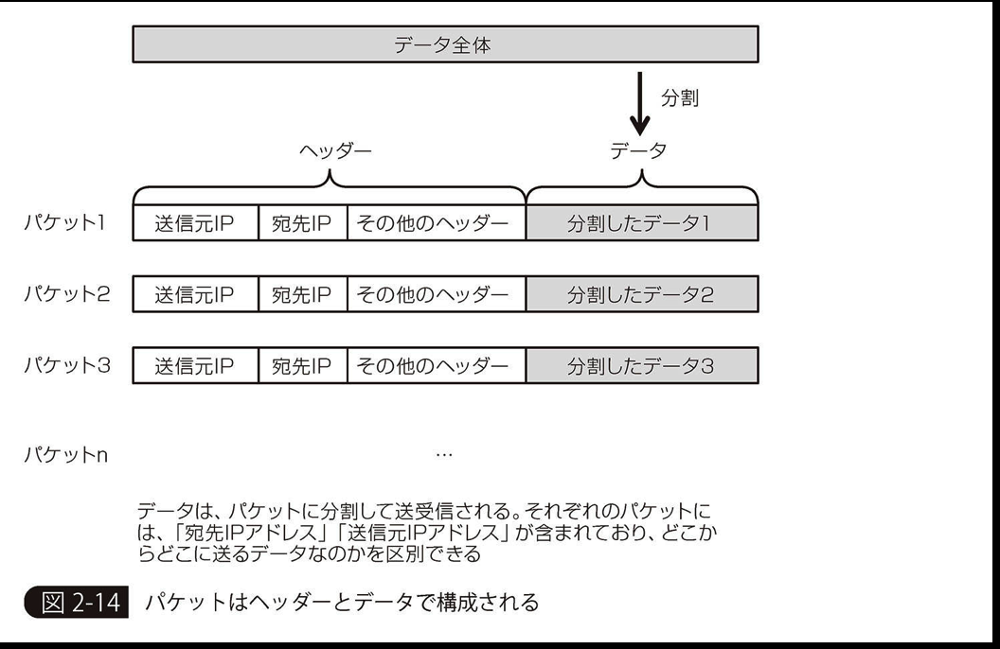

# chapter 1
サーバーというのは、「Linux」や「WindowsServer」など、サーバー用のOSをインストールしたコンピュータのこと

## VPC
AmazonVirtualPrivateCloudの略。ユーザー専用のプライベートなクラウド環境を提供するサービスである。

## NAT
NATはNetworkAddressTranslationの略で、内部だけで通用するアドレスを外部とも通信できるアドレスに変換する技術

NATを導入すると、「片方向だけの接続を許す」ことが実現できる。
たとえば、DBサーバーからはインターネットに接続できるが、逆に、インターネットからDBサーバーには接続できないという環境を実現できる

# chapter 2

# IPアドレス
TCP/IPで使われている通信先を特定するためのプロトコル。
IPアドレスは、32ビットで構成されている。

図のようにネットワーク部は同じネットワークに属する限りは同じ値
ホスト部が割り当てたいサーバーやクライアント、ネットワーク機器に対する値となる。

インターネットに接続する際に用いるIPアドレスのことを「パブリックIPアドレス」と言う。
インターネットで使われないものをプライベートIPアドレスという

## IPアドレスの表記方法

### CIDR表記(ClasslessInterDomainRouting)

IPアドレスを2進数で表記したとき、「ネットワーク部のビット長」を「/ビット長」で示す方法のこと
このビット長のことを「プレフィックス（prefix）」と言う。たとえば「192.168.1.0～192.168.1.255」の場合、プレフィックスは24ビット。
CIDR表記だと192.168.1.0/24」と記述される。

### サブネットマスク

「192.168.0.0～192.168.255.255」の場合、サブネットマスクは「255.255.0.0」で、「192.168.0.0/255.255.0.0」と表記する。

## パケット

### パケットフィルタリング
パケットフィルタリングは、流れるパケットを見て、通過の可否を決める仕組み。
パケットには、「IPアドレス」のほか「ポート番号」も含まれる
パケットフィルタリングは、「IPアドレス」と「ポート番号」など、パケットに付随する各種情報を見て、通過の可否を決める.

# デプロイ

## VPC

### VPCを作成する

「IPv4CIDRブロック」は、使用するIPアドレス範囲。「10.0.0.0/16」などと設定する。
後ほどこちらのネットワーク内にdbサーバーやapiサーバー(ec2インスタンス)を置く。

### subnetを作成する。

上記で決めた範囲のCIDRブロックをさらに細分化したCIDRブロックのことを「サブネット（Subnet）」と言う。
サブネットを作るとその部分だけでネットワークを分けることができる。

物理的に分散させるため複数Availability Zone(AZ)でsubnetを作成する。地理的な要因で起こる障害に対応するため。既存のものでは３つsubnetを作っている。

パブリックサブネットとプライベートサブネットがあり、パブリックはインターネットにアクセスすることを目的としたサブネットである。

### internet gateway(ig)を作成する

VPCとインターネットとの接続ポイントを作る。

### Route Tablesでinternet gatewayにつなげる

routesは下記の通りに

Destination: 172.31.0.0/16
Target: local

Destination: 0.0.0.0/0
Target: 作成したig

## RDS

postgreSQLエンジンで作る。
- Additional configurationでdatabasenameをつけておく(後ほどデータベースサーバーにつなぐ際に使用)
- standby instanceは小規模だと必要ないが、ある程度の規模のサービスだとアクセスを分散してI/Oのパフォーマンスを安定させられるので必要

## EC2

Security GroupsでSecurity Groupを作る。
InboundでHTTP(80)、HTTPS(443)、SSH(22)を開ける。Sourceはeverywhere(0.0.0.0/0)。
OutboundはAll trafficにする。

- EC2インスタンスをAmazon ECS-Optimized Amazon Linux 2 AMIで作る.
ecsに最適化されたAMIである。ECSでAWS Marketplaceで検索すれば出てくる。
- Auto-assign Public IPはdisableにする。Public IPは固定にしたいのでElastic IP address (EIP) を使うため
- IAMはecsInstanceRole
- 先述のSecurity Groupをアタッチしてportを開ける。
- Elastic IPsでAllocate new addressでEIPをつくったec2インスタンスに割り当てる。

## Route53　ドメイン取得

任意のドメインを取得する。
- サブドメインが必要な場合はこちらで登録する
-

## ACM(Certificate Manager) SSL証明書の発行

取得したドメインの証明書をリクエストする
- DNS validation
- SSLの証明書の検証をするためのドメインを自動で作ってくれる

## EC2

### Target Groups

target groupを作成する
- ProtocolはHTTP
- Health checksはDRFの場合、pathが"/"でSuccess codesが400

### Load Balancers

- internet facing
- ListenersはHTTPS
- Availability Zonesは作っておいたsubnet３つ
- Certificateはacmから、作っておいた証明書を使う

### Route53 ドメインをALBに割り当て

作ったALB(Application Load Balancer)にドメインを割り当てる。

## ECR　コンテナをpush

Amazon Elastic Container Registry (ECR) は、完全マネージド型の Docker コンテナレジストリです。このレジストリを使うと、開発者は Docker コンテナイメージを簡単に保存、管理、デプロイできます。

ECRにイメージをpushして登録

## ECS

フルマネージド型のコンテナオーケストレーションサービス
dockerをローカルで使うのは簡単だが、複数のクラスタ(ec2 インスタンス群) 上で管理するのは大変
それをマネージしてくれるのがecs、コンテナの管理、配置などをよしなにしてくれる

create cluster
- EC2 Linux + Networking templateを使う
- Provisioning ModelはOn-Demand Instance
- Subnetsは３つ共attachする

create new task definition
- Task RoleはecsTaskExecutionRole
- Task memory(MiB)とTask CPU(unit) はタスクが２つ走っても大丈夫なよう確保しておく
(Add Container)
- add continerでecrにpushしたコンテナをaddする
- コンテナのhard limits(これを越えるとOOMKiller が走り、コンテナが停止される)soft limits(ホストのメモリに余裕がある時は制限以上のメモリを使用する場合もあり)がある
- Port mappingsはhostは80でcontainer portはDRF(Django Rest framework)だと8000
- Environment variablesで必要な環境変数を定義する
- Log configurationでlogを出力するようにして置くとエラー対応がしやすい

create service
- launch typeはec2
- Load balancer typeはApplication Load Balancerで作っておいたlgを指定する
- Add to Load Balancerで作っておいたtgを指定する

Run new Task
- task definitionを使ってtaskを走らせる

## テスト

ここまで出来たらドメインにアクセスして正常に表示されるかチェックする。
出来ていない場合はCloud WatchのLog gropusなどでlogを確認してデバッグする。

## Circle CIで自動デプロイ

kts_apiやactaba_apiの.circleci/config.ymlを参考にして書く
circle_sha1でイメージversionをユニークに
masterブランチのみデプロイ
circle ciでawsのアクセスtokenなどを登録、aws系は全部必要になる

# 参考

Amazon Web Services 基礎からのネットワーク＆サーバー構築　改訂3版 Kindle版
https://www.amazon.co.jp/Amazon-Web-Services-%E5%9F%BA%E7%A4%8E%E3%81%8B%E3%82%89%E3%81%AE%E3%83%8D%E3%83%83%E3%83%88%E3%83%AF%E3%83%BC%E3%82%AF%EF%BC%86%E3%82%B5%E3%83%BC%E3%83%90%E3%83%BC%E6%A7%8B%E7%AF%89-%E6%94%B9%E8%A8%823%E7%89%88-%E5%A4%A7%E6%BE%A4-ebook/dp/B084QQ7TCF/ref=sr_1_5?__mk_ja_JP=%E3%82%AB%E3%82%BF%E3%82%AB%E3%83%8A&dchild=1&keywords=aws&qid=1602238206&sr=8-5

ecsについて

https://qiita.com/uzresk/items/6acc90e80b0a79b961ce

https://qiita.com/NewGyu/items/9597ed2eda763bd504d7#:~:text=%25E3%2582%25AF%25E3%2583%25A9%25E3%2582%25B9%25E3%2582%25BF%25E3%2583%25BC%25E3%2581%25AFContainer%2520Instance%25E3%25
